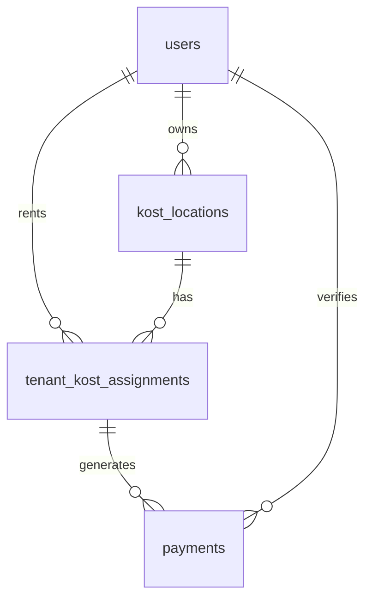

# 🏠 Kost Payment Management System

> **Sistem Manajemen Pembayaran Kost Berbasis Web**

Aplikasi web komprehensif untuk mengelola pembayaran kost (rumah sewa) yang dibangun dengan Laravel, React, dan MySQL. Sistem ini dirancang khusus untuk pemilik kost dan penghuni dengan fitur lengkap untuk tracking pembayaran, verifikasi, dan pelaporan.

## ✨ Fitur Utama

### 👤 Untuk Penghuni Kost (Tenant)
- **📝 Submit Pembayaran**: Input nominal, nama, dan upload screenshot bukti transfer
- **📊 Riwayat Pembayaran**: Lihat histori pembayaran lengkap dengan status
- **⏰ Deteksi Keterlambatan**: Notifikasi otomatis jika pembayaran terlambat
- **🏢 Cari Kost**: Browse dan bergabung dengan kost yang tersedia
- **📱 Mobile Responsive**: Akses mudah dari smartphone

### 🏢 Untuk Pemilik Kost (Owner)
- **✅ Verifikasi Pembayaran**: Approve/reject pembayaran dengan notes
- **🏘️ Multi-Location**: Kelola beberapa lokasi kost sekaligus
- **📈 Dashboard Analytics**: Statistik revenue, tenant, dan pembayaran pending
- **📊 Laporan Terperinci**: Generate laporan bulanan atau custom periode
- **📄 Export Data**: Download laporan dalam format PDF dan Excel
- **⚠️ Late Payment Alert**: Tracking otomatis pembayaran terlambat
- **💰 Quota Management**: Set tarif bulanan per penghuni

### 🎯 Fitur Sistem
- **🔐 Role-Based Access**: Akses berbeda untuk owner dan tenant
- **📤 File Upload**: Upload bukti pembayaran dengan validasi
- **🎨 Modern UI**: Interface responsive dengan TailwindCSS
- **🔍 Advanced Filtering**: Filter pembayaran berdasarkan status, periode, lokasi
- **📱 PWA Ready**: Progressive Web App untuk pengalaman mobile optimal

## 🛠️ Tech Stack

| Component | Technology |
|-----------|------------|
| **Backend** | Laravel 10 (PHP 8.1+) |
| **Frontend** | React 18 + Inertia.js |
| **Database** | MySQL 5.7+ |
| **Styling** | TailwindCSS 3.x |
| **Build Tool** | Vite |
| **PDF Export** | DomPDF |
| **Excel Export** | Maatwebsite Excel |
| **Charts** | Chart.js |
| **Icons** | Heroicons |

## 🚀 Quick Start

### 🎯 Pilih Method Deployment

| Method | Cocok Untuk | Kompleksitas |
|--------|-------------|--------------|
| **[cPanel](#-cpanel-deployment)** | Shared hosting, Production | ⭐⭐ Easy |
| **[Local Development](#-local-development)** | Development, Testing | ⭐⭐⭐ Medium |
| **[VPS/Dedicated](#deployment-guide)** | Full control, Custom setup | ⭐⭐⭐⭐ Advanced |

---

## 🌐 cPanel Deployment

> **Untuk shared hosting tanpa Node.js access**

### 🎯 Gunakan Script Automated

**2 script utama tersedia:**

1. **`cpanel-deploy.sh`** - Suite lengkap untuk deployment cPanel
2. **`deploy-tools.sh`** - Tools deployment dan maintenance

```bash
# Setup lengkap untuk cPanel
./cpanel-deploy.sh

# Tools deployment dan maintenance  
./deploy-tools.sh
```

**cpanel-deploy.sh** menyediakan:
- ✅ Complete Setup (konfigurasi lengkap)
- ✅ Build Frontend (compile assets)
- ✅ Create Package (buat deployment package)
- ✅ Install to cPanel (proses instalasi)
- ✅ Maintenance Tools (backup, logs, dll)

**deploy-tools.sh** menyediakan:
- ✅ Quick Deploy (deploy cepat)
- ✅ Backup System (backup aplikasi & database)
- ✅ Update Application (update otomatis)
- ✅ Health Check (cek kesehatan aplikasi)
- ✅ Database Tools (migration, seeder, dll)
- ✅ Log Management (kelola log)

### Manual cPanel Setup

1. **Compile Assets (Local)**
```bash
npm install
npm run build
```

2. **Upload Files**
   - Upload semua file ke root cPanel (bukan public_html)
   - Upload folder `public/` ke `public_html/`
   - Upload folder `public/build/` ke `public_html/build/`

3. **Database Setup**
   - Buat MySQL database di cPanel
   - Import `database/database.sql`
   - Update `.env` dengan credentials

4. **Instalasi Dependencies**
```bash
composer install --optimize-autoloader --no-dev
php artisan key:generate --force
php artisan migrate --force
```

5. **Set Permissions**
```bash
chmod -R 755 .
chmod -R 775 storage bootstrap/cache
```

**Default Login (cPanel):**
- **Owner**: owner@example.com / password
- **Tenant**: tenant@example.com / password

---

## 💻 Local Development

### Prerequisites
- **PHP 8.1+**
- **Node.js 16+**
- **MySQL 5.7+**
- **Composer**

### Setup

1. **Clone & Install**
```bash
git clone [repository-url] kost-payment
cd kost-payment

# Install dependencies
composer install
npm install

# Environment setup
cp .env.example .env
php artisan key:generate
```

2. **Database Setup**
```bash
# Create database
mysql -u root -p
CREATE DATABASE kost_payment;
exit

# Update .env
DB_DATABASE=kost_payment
DB_USERNAME=root
DB_PASSWORD=your_password

# Run migrations
php artisan migrate --seed
```

3. **Build & Run**
```bash
# Build frontend
npm run build

# Start server
php artisan serve
```

**Access:** http://localhost:8000

**Default Login (Local):**
- **Owner**: owner@kost.com / password
- **Tenant**: tenant@kost.com / password

---

## 📁 Struktur Project

```
kost-payment/
├── 📂 app/
│   ├── Http/Controllers/     # API & Web Controllers
│   ├── Models/              # Eloquent Models
│   └── Http/Middleware/     # Custom Middleware
├── 📂 database/
│   ├── migrations/          # Database Schema
│   ├── seeders/            # Sample Data
│   └── database.sql        # SQL Export
├── 📂 frontend/            # React Components
│   ├── resources/js/Pages/ # Inertia Pages
│   ├── resources/js/Layouts/ # Layout Components
│   └── resources/css/      # Styles
├── 📂 public/              # Web Assets
├── 📂 storage/             # File Storage
├── setup-cpanel.sh         # cPanel Setup Wizard
├── install-cpanel.sh       # cPanel Installer
└── DEPLOYMENT.md           # Deployment Guide
```

## 🔐 Security Features

- **Role-based Authentication** (Owner/Tenant)
- **CSRF Protection** pada semua forms
- **Input Validation** comprehensive
- **File Upload Security** dengan type validation
- **SQL Injection Protection** via Eloquent ORM
- **XSS Protection** dengan output escaping
- **Password Hashing** dengan bcrypt
- **Session Security** dengan secure cookies

## 📊 Database Schema

### Core Tables
- **users** - User management (Owner/Tenant)
- **kost_locations** - Kost properties
- **tenant_kost_assignments** - Tenant-Kost relationships
- **payments** - Payment records
- **password_reset_tokens** - Password reset
- **sessions** - User sessions

### Relationships


## 🎯 User Roles & Permissions

### 🏢 Owner (Pemilik Kost)
- Kelola multiple kost locations
- Verifikasi pembayaran tenant
- Generate laporan keuangan
- Set tarif dan aturan pembayaran
- View analytics dan dashboard

### 👤 Tenant (Penghuni)
- Submit pembayaran bulanan
- Upload bukti transfer
- View riwayat pembayaran
- Join/leave kost locations
- Profile management

## 🔧 Configuration

### Environment Variables
```env
# Application
APP_NAME="Kost Payment"
APP_ENV=production
APP_DEBUG=false
APP_URL=https://yourdomain.com

# Database
DB_CONNECTION=mysql
DB_HOST=127.0.0.1
DB_PORT=3306
DB_DATABASE=kost_payment
DB_USERNAME=your_username
DB_PASSWORD=your_password

# File Storage
FILESYSTEM_DISK=local
MAX_UPLOAD_SIZE=10240  # 10MB
```

### PHP Requirements
```json
{
  "php": "^8.1",
  "ext-pdo": "*",
  "ext-pdo_mysql": "*",
  "ext-mbstring": "*",
  "ext-openssl": "*",
  "ext-tokenizer": "*",
  "ext-xml": "*",
  "ext-ctype": "*",
  "ext-json": "*",
  "ext-bcmath": "*"
}
```

## 🚨 Troubleshooting

### Common Issues

| Issue | Solution |
|-------|----------|
| 500 Internal Server Error | Check file permissions & .env config |
| Database Connection Error | Verify DB credentials in .env |
| Missing CSS/JS Assets | Compile frontend: `npm run build` |
| File Upload Fails | Check storage permissions & PHP limits |
| Login Issues | Clear cache: `php artisan cache:clear` |
| CSRF Token Mismatch | Check APP_URL in .env matches domain |

### Debug Commands
```bash
# Check configuration
php artisan config:show

# Clear all cache
php artisan optimize:clear

# Check routes
php artisan route:list

# View logs
tail -f storage/logs/laravel.log
```

### Performance Optimization
```bash
# Production optimization
php artisan config:cache
php artisan route:cache
php artisan view:cache
composer install --optimize-autoloader --no-dev
```

## 📞 Support & Documentation

- **🚀 Quick Setup**: Gunakan `./setup-cpanel.sh` untuk guided installation
- **📖 Deployment Guide**: Lihat `DEPLOYMENT.md` untuk setup detail
- **🐛 Issues**: Check troubleshooting section di atas
- **📊 Performance**: Monitor via `check-performance.php` (cPanel)

## 📄 License

This project is licensed under the MIT License - see the LICENSE file for details.

## 🤝 Contributing

1. Fork the repository
2. Create feature branch (`git checkout -b feature/amazing-feature`)
3. Commit changes (`git commit -m 'Add amazing feature'`)
4. Push to branch (`git push origin feature/amazing-feature`)
5. Open a Pull Request

---

**💡 Tip**: Untuk setup cPanel yang mudah, gunakan wizard: `./setup-cpanel.sh`
   ```bash
   # Download project files
   # Upload to public_html directory
   ```

2. **Database Setup**
   ```sql
   # Import database/database.sql via phpMyAdmin
   ```

3. **Configuration**
   ```bash
   # Edit .env file
   chmod +x install.sh
   ./install.sh
   ```

4. **Access Application**
   ```
   https://yourdomain.com
   ```

### Method 2: Local Development

```bash
# Clone repository
git clone <repository-url>
cd kost-payment

# Install PHP dependencies
composer install

# Install Node.js dependencies
npm install

# Environment setup
cp .env.example .env
php artisan key:generate

# Database setup
php artisan migrate
php artisan db:seed

# Build assets
npm run build

# Serve application
php artisan serve
```

## ⚙️ Environment Configuration

```env
# Application
APP_NAME="Kost Payment Management"
APP_ENV=production
APP_DEBUG=false
APP_URL=https://yourdomain.com

# Database
DB_CONNECTION=mysql
DB_HOST=127.0.0.1
DB_PORT=3306
DB_DATABASE=kost-payment
DB_USERNAME=root
DB_PASSWORD=root

# File Upload
UPLOAD_MAX_FILESIZE=2048
UPLOAD_ALLOWED_TYPES=jpeg,png,jpg

# Localization
APP_TIMEZONE=Asia/Jakarta
APP_LOCALE=id
```

## 👥 Default Users

| Role | Email | Password | Description |
|------|-------|----------|-------------|
| **Owner** | `owner@kost.com` | `password123` | Pemilik kost dengan 2 lokasi sample |
| **Tenant** | `tenant@kost.com` | `password123` | Penghuni dengan histori pembayaran |

⚠️ **Penting**: Ganti password default setelah instalasi!

## 📊 Database Schema

```sql
users                     # User accounts (owner/tenant)
├── id, name, email, role
├── phone, address
└── password, timestamps

kost_locations           # Kost properties
├── id, owner_id, name
├── address, city
├── monthly_rate, total_rooms
└── description, timestamps

tenant_kost_assignments  # Tenant room assignments
├── id, tenant_id, kost_location_id
├── room_number, monthly_quota
├── start_date, end_date, is_active
└── timestamps

payments                 # Payment records
├── id, tenant_id, kost_location_id
├── assignment_id, amount
├── payment_date, payment_month, payment_year
├── payment_proof, status
├── verified_at, verified_by
├── is_late, days_late
└── timestamps
```

## 📁 Project Structure

```
kost-payment/
├── 📂 app/
│   ├── 📂 Http/Controllers/     # API endpoints
│   ├── 📂 Models/              # Eloquent models
│   └── 📂 Providers/           # Service providers
├── 📂 database/
│   ├── 📂 migrations/          # Database migrations
│   ├── 📂 seeders/             # Sample data
│   └── 📄 database.sql         # Complete SQL dump
├── 📂 public/                  # Web-accessible files
├── 📂 resources/
│   ├── 📂 js/                  # React components
│   ├── 📂 css/                 # Styles
│   └── 📂 views/               # Blade templates
├── 📂 routes/                  # Application routes
├── 📂 storage/                 # File uploads & logs
├── 📄 .env                     # Environment config
├── 📄 composer.json            # PHP dependencies
├── 📄 package.json             # Node.js dependencies
├── 📄 install.sh               # Installation script
└── 📄 DEPLOYMENT.md            # Deployment guide
```

## 🎮 Usage Guide

### For Tenants
1. **Login** dengan akun tenant
2. **Dashboard** - Lihat status pembayaran dan tagihan
3. **Submit Payment** - Upload bukti pembayaran
4. **Payment History** - Track riwayat pembayaran
5. **Join Kost** - Cari dan bergabung dengan kost baru

### For Owners
1. **Login** dengan akun owner
2. **Dashboard** - Monitoring revenue dan statistik
3. **Payments** - Verifikasi pembayaran masuk
4. **Reports** - Generate dan export laporan
5. **Kost Management** - Kelola properti dan tenant

## 🔧 Advanced Features

### Payment Processing
- **Auto Late Detection**: Sistem otomatis mendeteksi keterlambatan berdasarkan tanggal 5 setiap bulan
- **Proof Validation**: Upload gambar dengan validasi format dan ukuran
- **Status Tracking**: Pending → Verified/Rejected workflow

### Reporting & Analytics
- **Revenue Reports**: Laporan pendapatan per periode
- **Tenant Analytics**: Statistik penghuni dan okupansi
- **Export Options**: PDF untuk laporan formal, Excel untuk analisis data
- **Filter Options**: Berdasarkan lokasi, periode, status pembayaran

### Multi-Location Management
- **Property Portfolio**: Kelola multiple kost dalam satu akun
- **Room Management**: Track okupansi dan ketersediaan kamar
- **Individual Pricing**: Set tarif berbeda per lokasi

## 🛡️ Security Features

- **Role-Based Access Control**: Pemisahan akses owner dan tenant
- **File Upload Security**: Validasi file type dan size
- **CSRF Protection**: Laravel built-in CSRF protection
- **SQL Injection Prevention**: Eloquent ORM protection
- **XSS Protection**: Input sanitization

## 📱 Mobile Optimization

- **Responsive Design**: Optimal di semua device
- **Touch-Friendly**: Interface yang mudah digunakan di mobile
- **Fast Loading**: Optimized assets dan lazy loading
- **PWA Ready**: Installable web app

## 🔄 API Endpoints

```http
POST   /login              # User authentication
POST   /logout             # User logout
GET    /owner/dashboard    # Owner dashboard data
POST   /owner/payments/{id}/verify  # Verify payment
GET    /owner/reports      # Generate reports
POST   /tenant/payment     # Submit payment
GET    /tenant/history     # Payment history
```

## 🚀 Performance Optimization

- **Asset Bundling**: Vite untuk optimasi bundle size
- **Database Indexing**: Proper indexing untuk query performance
- **Caching**: Route, config, dan view caching
- **Image Optimization**: Compressed image uploads
- **Lazy Loading**: Component-based loading

## 🧪 Testing

```bash
# Run PHP tests
php artisan test

# Run JavaScript tests
npm run test

# Code coverage
php artisan test --coverage
```

## 📈 Roadmap

- [ ] **WhatsApp Integration**: Notifikasi via WhatsApp
- [ ] **Mobile App**: React Native version
- [ ] **Bank Integration**: Auto-verify melalui bank API
- [ ] **Multi-language**: Support bahasa Inggris
- [ ] **Tenant Portal**: Advanced tenant features
- [ ] **Analytics Dashboard**: Advanced reporting

## 🤝 Contributing

1. Fork the repository
2. Create feature branch (`git checkout -b feature/amazing-feature`)
3. Commit changes (`git commit -m 'Add amazing feature'`)
4. Push to branch (`git push origin feature/amazing-feature`)
5. Open Pull Request

## 📄 License

This project is licensed under the MIT License - see the [LICENSE](LICENSE) file for details.

## 📞 Support

- **Documentation**: See [DEPLOYMENT.md](DEPLOYMENT.md) for detailed setup
- **Issues**: Report bugs via GitHub Issues
- **Email**: support@kostpayment.com
- **Phone**: +62-xxx-xxxx-xxxx

---

<div align="center">

**Built with ❤️ in Indonesia**

Made for Indonesian kost management needs

[🌟 Star this repo](https://github.com/your-repo) | [🐛 Report Bug](https://github.com/your-repo/issues) | [💡 Request Feature](https://github.com/your-repo/issues)

</div>
